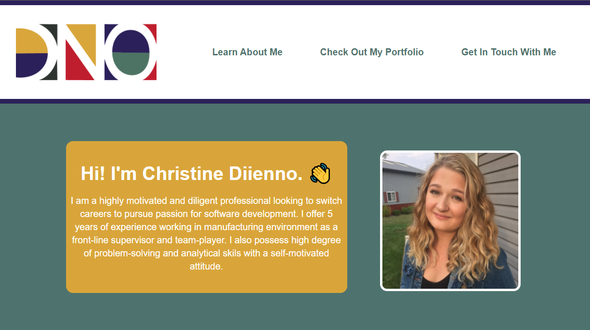

# Christine's Portfolio

This portfolio demonstrates my ability to build a website from the ground up using HTML and CSS. I was able to make the site responsive using flexbox, media queries and CSS varaibles. 

I'll continue to build this portfolio as I progress throughout Rutger's Coding Bootcamp and build new applications.

You can access the deployed application <a href="https://mrsdno.github.io/christines-portfolio/">here</a>!

